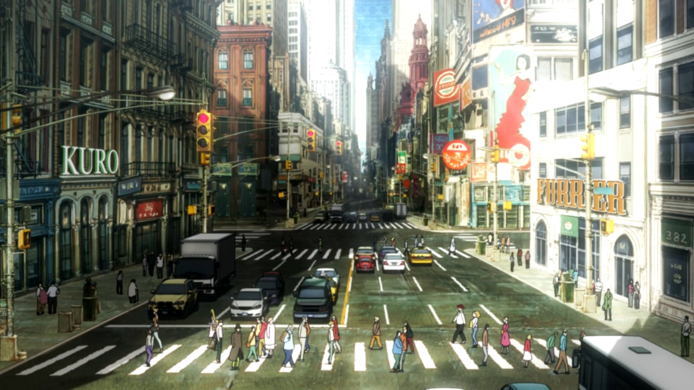

<html><head><title>A Look Inside.</title>
<meta charset="UTF-8">
<meta name="viewport" content="width=device-width, initial-scale=1">
<link rel="stylesheet" href="https://www.w3schools.com/w3css/4/w3.css">
<link rel="stylesheet" href="https://fonts.googleapis.com/css?family=Inconsolata">

</head><body>

<!-- Links (sit on top) -->

  

    

      <a href="#" class="w3-button w3-block w3-black">HOME</a>
    

    

      <a href="#about" class="w3-button w3-block w3-black">ABOUT</a>
    

    

      <a href="#menu" class="w3-button w3-block w3-black">UTILITY BELT</a>
    

    

      <a href="#where" class="w3-button w3-block w3-black">WHERE</a>
    

  

<!-- Header with image -->
<header class="bgimg w3-display-container w3-grayscale-min" id="home">
  

  

  

     
  

  

    
  

</header>

<!-- Add a background color and large text to the whole page -->

<!-- About Container -->

  

    <h5 class="w3-center w3-padding-64">About Me</h5>
    
My name is Vasilios Kostakis, I was born in the summer of 1993, in Flushing NY.  My interest for programming came from a young age, but it was not until I was older that I acted on these interests.  I am decently fresh when it comes to the coding world,  but I have a fervor in constatnly learning new things and increase the tools on my belt.

    
The current languages that I am comfortable with and know are for web development, but I do not plan to stop there and only to expand my horizons.  I have many goals, but one goal is to hopefully be able to use my knowledge in the game industry.

    

      
<i>"There is nothing permanent, except change." </i>

      
Heraclitus of Ephesus

    

    
    
<strong></strong>

    
<strong></strong>

  

<!-- Menu Container -->

  

    <h5 class="w3-center w3-padding-48">Skills and Hobbies</h5>

    

      <a href="javascript:void(0)" onclick="openMenu(event, 'Eat');" id="myLink">
        
Skills

      </a>
      <a href="javascript:void(0)" onclick="openMenu(event, 'Drinks');">
        
Hobbies

      </a>
    

    

      <h5>HTML</h5>
      
Well versed in html and comfortable with anything.
 

      <h5>CSS</h5>
      
I understand CSS quite well even if I do find it a bit tedious.
 

      <h5>Javascript</h5>
      
I am very confident in my ability of javascript, and do enjoy learning new things.
 

      <h5>PHP and Ajax</h5>
      
Pursuing to increase my usage of PHP, I only have a basic level of PHP and Ajax.
 

      <h5>jQuery</h5>
      
A good foundation because of my usage of javascript.

    

    

      <h5>Gaming</h5>
      
Can not deny my favorite and first hobby.  Learning code has only made my perception grow, where once if some anomaly happened in game I would brush it off, but now I question what caused that reaction.
 

      <h5>Networking/Socializing</h5>
      
I enjoy meeting new people, especially other programmers.  Everytime I discuss code with someone it's a learning experience.
 

      <h5>Programming</h5>
      
Every time I read or write code, I feel as if im doing a puzzle.  I just need to put the right pieces in the right places.
 

      <h5>Sleeping</h5>
      
Who doesn't love a good nap.
 

      <h5>Learning</h5>
      
Getting the opportunity to learn code has lit a fire where I thought, had burned out, I constantly want to learn new things, be it languages or tips and tricks.

    

    
  

<!-- Contact/Area Container -->

  

    <h5 class="w3-center w3-padding-48">Where to find me.</h5>
    
I like to tell myself I'm approachable, so please feel free to contact me.

    
    

    
<strong></strong>

    <form action="mailto:vasilioskostakis93@gmail.com" target="_blank">
      
<input class="w3-input w3-padding-16 w3-border" type="text" placeholder="Name" required="" name="Name">

      

      

      
<input class="w3-input w3-padding-16 w3-border" type="text" placeholder="Message" required="" name="Message">

      
<button class="w3-button w3-black" type="submit">SEND MESSAGE</button>

    </form>
  

<!-- End page content -->

<!-- Footer -->
<footer class="w3-center w3-light-grey w3-padding-48 w3-large">

</footer>

</body></html>
